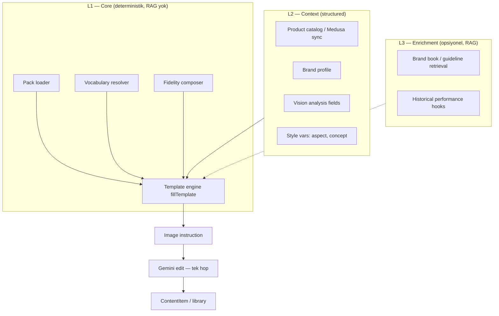
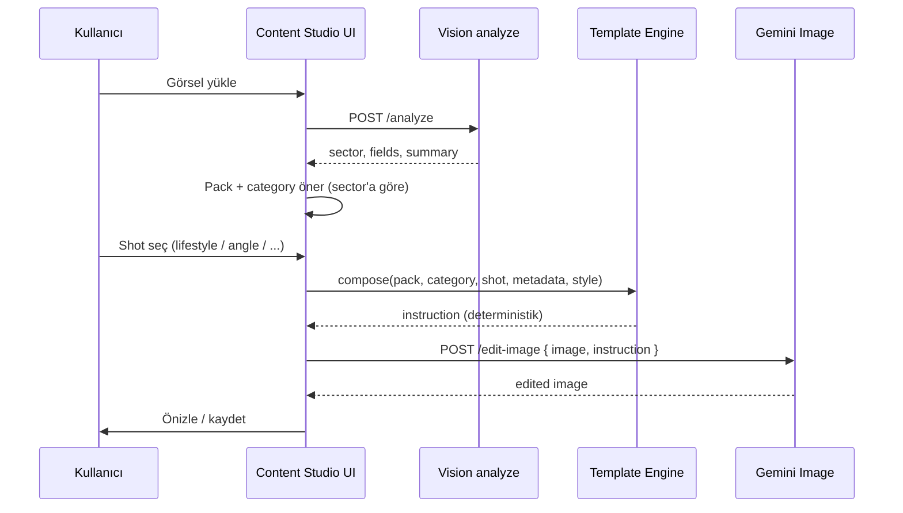

# Content Studio — Pack & Template Engine Mimarisi

> **Durum:** Taslak mimari (2026-07-06)  
> **Bağlam:** Bega Home `scripts/` pipeline'ının Levios İçerik Stüdyosu'na taşınması  
> **İlgili:** [content-studio ürün niyeti](../../../helm/docs/content-studio.md) · [content plugin](./plugins/content.md) · [Task #0011](../tasks/0011-content-studio-pack-engine.md)

---

## 1. Özet

İçerik Stüdyosu'nun görsel üretim çekirdeği **generic prompt kütüphanesi + LLM ara katmanı** olmamalıdır. Kanıtlanmış model:

**Yapılandırılmış metadata → kategori × shot şablonu → domain sözlüğü → deterministik `fillTemplate` → referans görsel + fidelity prefix → tek adım Gemini edit.**

Bu mimari Bega Home'da (`generate-prompts.ts` / `generate-images.ts` / `generate-seating.ts`) production'da çalışmıştır. Levios'taki mevcut `prompt-library.data.json` (96 duplicate mobilya + Midjourney metinleri) bu modelin **yanlış adaptasyonudur**.

**RAG gerekli değildir** çekirdek için. RAG yalnızca opsiyonel L3 enrichment katmanında (brand book PDF, geçmiş kampanya performansı) düşünülür.

---

## 2. Problem tanımı

### 2.1 Mevcut durum (Levios)

| Bileşen | Davranış | Sorun |
|---------|----------|-------|
| `prompt-library.data.json` | 333 prompt, 96'sı `image-prompt` | Mobilya/Midjourney odaklı, duplicate |
| `deriveMode()` | Tüm JSON image-prompt → `transform` | UI yanıltıcı; template aslında generate |
| `edit-image` route | Library prompt → **LLM** → instruction → Gemini | 2-hop; bağlam kaybı |
| Sector filter `Tümü` | 119 görsel prompt kartı listelenir (96 library + 23 sector) | Gürültü; sektör dışı öneriler |
| Variable örnekleri | `Bega Home`, `Nordic Zigon Sehpa` | Her tenant'a mobilya örneği |

### 2.2 Referans durum (Bega Home)

| Bileşen | Davranış | Neden işe yaradı |
|---------|----------|------------------|
| `product-catalog.json` | Ürün metadata: category, color, legs, style | Prompt hesaplanır, yazılmaz |
| 6 kategori × 4 shot | 24 base template → 324 görsel | Az şablon, çok çıktı |
| `fillTemplate()` | `{COLOR}`, `{LEGS}` deterministik | Tutarlı, debug edilebilir |
| `GLOBAL_PREFIX` / `STRICT IDENTITY` | Referans görsel fidelity | Ürün bozulmuyor |
| `generate-images.ts` | Referans + prompt → Gemini **tek adım** | Latency düşük, kalite yüksek |
| `progress.json` | Resume, retry, skip completed | Production pipeline |

### 2.3 Hedef

Aynı deterministik mimariyi Levios'a taşımak; multi-tenant ve çok sektörlü (mobil oyun, mobil app, SaaS web, mobilya/e-ticaret) hale getirmek — **generic 333 prompt listesini görsel çekirdekten çıkarmak**.

---

## 3. Domain modeli

### 3.1 Kavramlar (sözlük)

```
Tenant
  └── Pack (sektör / mağaza paketi)
        ├── Vocabulary (domain sözlüğü)
        ├── Categories (ürün/içerik tipleri)
        │     └── Shots (çekim / kullanım tipleri)
        │           └── Template (system + user instruction)
        ├── FidelityRules (referans görsel koruma talimatları)
        └── Catalog? (opsiyonel ürün listesi — Bega Home modeli)

Asset (yüklenen görsel/video kare)
  └── AnalysisResult (vision: sector, fields, summary)

GenerationJob
  ├── pack_id, category_id, shot_id
  ├── filled_prompt
  ├── reference_asset
  └── output (ContentItem)
```

### 3.2 Pack

Bir **pack**, belirli bir dikey veya mağaza için küratörlü üretim kurallarının tamamıdır.

Örnekler:

| Pack ID | Kapsam | Kaynak |
|---------|--------|--------|
| `begahome-furniture` | Mobilya e-ticaret, 6 kategori, 4-5 shot | Bega Home scripts |
| `mobile-game-ua` | ASO, UA reklam, TikTok cover | `sector-packs.ts` (genişletilecek) |
| `mobile-app-aso` | App Store screenshot, lifestyle | sector-packs |
| `saas-web-social` | OG card, dashboard hero, testimonial | sector-packs |

Pack'ler **merge edilebilir**: platform varsayılan pack + tenant override pack.

### 3.3 Category

Ürün veya medya **tipi**. Prompt mantığını belirler.

**Mobilya (Bega Home):** `zigon`, `orta`, `c-sehpa`, `kanepe`, `berjer`, `kose`

**Mobil oyun:** `key-art`, `aso-screenshot`, `feature-graphic`, `ua-story`, `tiktok-cover`

**Mobil app:** `aso-screenshot`, `lifestyle-mockup`, `feature-callout`, `app-icon`

**SaaS web:** `dashboard-hero`, `og-card`, `landing-hero`, `testimonial-card`

### 3.4 Shot

Aynı kategori için **farklı pazarlama amacı / kompozisyon**. Bega Home'dan:

| Shot | Amaç | Tipik aspect |
|------|------|--------------|
| `lifestyle` | Ürünü gerçek ortamda, satın alınabilir his | 4:3, 4:5 |
| `angle` | Stüdyo / alternatif açı, ürün net | 1:1 |
| `detail` | Malzeme, dikiş, bacak detayı | 4:3 |
| `usage` | Kullanım anı, insan/nesne ile | 4:3, 16:9 |

Koltuk için ek shot: `studio` (`generate-seating.ts`).

Shot = kullanıcının UI'da seçtiği **“ne tür çıktı istiyorum”** — 119 prompt kartı değil.

### 3.5 Vocabulary

Ham metadata → zengin İngilizce görsel dili. Örnek (`generate-prompts.ts`):

```ts
legsDesc["tapered"] → "tapered conical legs"
colorShort["walnut"] → "walnut"
getSurface("walnut") → "rich walnut wood grain with light-to-dark striped pattern"
```

LLM bu çevirileri **uydurmaz**; pack tanımlar.

### 3.6 Fidelity prefix

Referans görselin korunması için **her görsel prompt'un başına** eklenen sabit talimat bloğu.

Bega Home (`generate-images.ts`):

```
CRITICAL: The generated furniture must be an EXACT replica of the reference image...
```

Koltuk (`generate-seating.ts`):

```
STRICT IDENTITY: This is a SINGLE-SEAT ARMCHAIR...
STRICT FIDELITY TO REFERENCE IMAGE: ...
```

Pack başına `fidelity.global` + kategori başına `fidelity.identity` (opsiyonel).

### 3.7 Catalog (opsiyonel)

Bega Home `product-catalog.json`: her SKU için structured fields. Vision analiz veya Medusa product sync ile doldurulabilir.

Catalog **yoksa**: kullanıcı marka profili + vision `analysisFields` yeterli (oyun/app/saas).

---

## 4. Mimari katmanlar



### 4.1 L1 — Template Engine (zorunlu)

**Sorumluluk:** Nihai görsel talimatını **hesapla**. LLM prompt yazmaz.

```ts
interface FillInput {
  packId: string
  categoryId: string
  shotId: string
  metadata: Record<string, string>  // catalog row + brand + analysis
  style?: { aspect?: string; concept?: string }
}

interface FillOutput {
  instruction: string      // Gemini'ye giden tek metin
  mode: "transform" | "generate"
  meta: { packId; categoryId; shotId; templateVersion }
}

function composeInstruction(input: FillInput): FillOutput
```

**Kurallar:**

1. Template'de `{{TOKEN}}` → vocabulary + metadata ile doldurulur.
2. Boş token → pack default veya hata (sessiz example fallback yok).
3. `fidelity.global` + `fidelity.category` instruction başına eklenir.
4. `style.aspect` / `style.concept` çakışan `--ar` ifadelerini override eder (mevcut `styleDirective` mantığı).

### 4.2 L2 — Context (structured, RAG değil)

| Kaynak | Ne sağlar | Öncelik |
|--------|-----------|---------|
| Vision analyze | `sector`, `GAME_NAME`, `PRODUCT_CATEGORY`… | Yükleme sonrası otomatik |
| Brand profile | `BRAND_NAME`, `BRAND_VOICE`, `TONE`… | localStorage / tenant DB |
| Product catalog | `category`, `color`, `legs`… | Bega Home / Medusa ürün |
| UI presets | aspect 4:5, 9:16; cultural concept | Kullanıcı seçimi |

Hepsi **key-value**. Vektör arama gerekmez.

### 4.3 L3 — Enrichment (opsiyonel RAG)

**Ne zaman:** Tenant brand book PDF yüklemiş; “geçen ay en iyi hook'lar” önerisi; rakip analizi.

**Ne zaman değil:** Görsel fidelity pipeline; shot seçimi; template doldurma.

RAG çıktısı L1'e **doğrudan karıştırılmaz**. Metin adımında (caption/script) veya UI'da “ilham” panelinde kullanılır.

---

## 5. Uçtan uca akışlar

### 5.1 Görsel üretim (ana akış)



**Kritik fark:** `edit-image` artık library prompt → LLM → instruction **yapmaz**. Instruction L1'den gelir.

### 5.2 Bega Home batch pipeline (referans)

Mevcut script akışı Levios'ta **admin/batch job** veya CLI olarak korunabilir:

```
catalog.json → for each product → for each shot → compose → gemini → save → progress.json
```

Content Studio UI = aynı engine'in interaktif yüzü.

### 5.3 Metin üretim (caption / script)

Metin için mevcut prompt library **kalabilir** (sector-neutral `universal`). Görselden bağımsız; LLM tek hop mantıklı.

Pack engine ile bağ: üretilen görselin `shot` + `category` metadata'sı metin prompt variable'larına enjekte edilir (`TOPIC`, `KEY_FEATURE`).

### 5.4 Çoklu tenant

```
tenant_id
  → default_pack_ids[]     (entitlement: hangi sektörler açık)
  → brand_profile          (tenant DB, localStorage yerine)
  → catalog_sync           (Medusa products → pack metadata)
  → pack_overrides/        (tenant-specific vocabulary tweak)
```

RLS: `content_items`, `brand_profiles`, `pack_configs` tablolarında `tenant_id` (ADR-0001).

---

## 6. Pack dosya formatı (öneri)

```json
{
  "id": "begahome-furniture",
  "version": "1.0.0",
  "sector": "furniture",
  "label": "Mobilya / E-ticaret",
  "fidelity": {
    "global": "CRITICAL: The generated furniture must be an EXACT replica..."
  },
  "vocabulary": {
    "colorShort": { "walnut": "walnut", "white": "white lacquered" },
    "legsDesc": { "tapered": "tapered conical legs" },
    "resolvers": ["getSurface", "getSofaColor", "getNestCount"]
  },
  "categories": {
    "zigon": {
      "label": "Zigon sehpa",
      "identity": null,
      "metadataSchema": ["color", "legs", "style"],
      "shots": {
        "lifestyle": {
          "label": "Yaşam alanı",
          "mode": "transform",
          "aspect": "4:3",
          "template": "Create a photorealistic editorial interior photo: A set of {COUNT} {COLOR} nesting tables with {LEGS}..."
        },
        "angle": { "...": "..." },
        "detail": { "...": "..." },
        "usage": { "...": "..." }
      }
    }
  },
  "catalog": {
    "source": "medusa-products",
    "mapping": {
      "category": "metadata.furniture_category",
      "color": "metadata.color",
      "legs": "metadata.legs"
    }
  }
}
```

**Resolver fonksiyonları** TypeScript'te pack loader'a kayıtlı (`getSurface`, `getNestCount`…). JSON sadece isim referansı verir.

---

## 7. Kod yerleşimi (hedef)

```
wesanjs/packages/plugins/content/src/
  lib/
    packs/
      loader.ts              # pack JSON yükle, merge tenant override
      template-engine.ts     # fillTemplate, composeInstruction
      resolvers/
        furniture.ts           # Bega Home getSurface, getSofaColor...
        mobile-game.ts
      data/
        begahome-furniture.pack.json
        mobile-game-ua.pack.json
        mobile-app-aso.pack.json
        saas-web-social.pack.json
    ai/
      content-generator.ts   # editImage — instruction doğrudan alır
      prompt-library.ts      # SADECE metin promptları (image-prompt deprecate)
  api/admin/content/
    packs/route.ts           # list packs, categories, shots
    compose/route.ts         # deterministik instruction önizleme
    edit-image/route.ts      # instruction | promptId(depre) | free-text
    analyze/route.ts         # sector + fields (mevcut)
```

UI:

```
dashboard/src/routes/content/
  components/
    pack-picker.tsx          # sector → category → shot (kart şeridi yerine)
    shot-preview.tsx         # fillTemplate önizleme, LLM yok
```

---

## 8. Mevcut sistemden geçiş

### 8.1 Deprecate

| Mevcut | Aksiyon |
|--------|---------|
| `prompt-library.data.json` image-prompt (96 adet) | Kaldır veya `deprecated: true`, UI'da gizle |
| `edit-image` LLM expansion step | Görsel pack shot'ları için devre dışı |
| `deriveMode()` furniture hack | Pack shot `mode` alanı tek kaynak |
| `Tümü` sector filter (görsel) | Kaldır; sector zorunlu |

### 8.2 Koru / taşı

| Mevcut | Aksiyon |
|--------|---------|
| `sector-packs.ts` (31 prompt: 23 image + 8 video) | Pack JSON'a migrate et |
| Bega Home `generate-*.ts` | `begahome-furniture.pack.json` + resolvers |
| `styleDirective`, aspect/concept UI | L2 style vars olarak kal |
| Metin prompt library | L1 dışında kal |
| Vision analyze | L2 context kaynağı |

### 8.3 Geriye uyumluluk

Geçiş döneminde `promptId` ile eski library çağrıları çalışabilir; log'da deprecation uyarısı. 90 gün sonra kaldır.

---

## 9. API sözleşmesi (hedef)

### `GET /admin/content/packs`

```json
{
  "packs": [
    { "id": "mobile-game-ua", "sector": "mobile-game", "label": "...", "categories": [...] }
  ]
}
```

### `POST /admin/content/compose`

Request:

```json
{
  "packId": "begahome-furniture",
  "categoryId": "zigon",
  "shotId": "lifestyle",
  "metadata": { "color": "walnut", "legs": "tapered" },
  "style": { "aspect": "4:5" }
}
```

Response:

```json
{
  "instruction": "CRITICAL: The generated...",
  "mode": "transform",
  "preview": { "packId", "categoryId", "shotId" }
}
```

### `POST /admin/content/edit-image`

```json
{
  "image": { "data": "...", "mime": "image/png" },
  "instruction": "..." 
}
```

`promptId` + `variables` → deprecated path.

---

## 10. UI değişikliği (pack-first)

### Mevcut (sorunlu)

```
119 prompt kartı → seç → değişken doldur → LLM → üret
```

### Hedef

```
Görsel yükle → analiz → sektör pack'i
  → Kategori (zigon / ASO screenshot / dashboard hero)
    → Shot (lifestyle / angle / detail / usage)
      → Otomatik doldurulmuş önizleme (deterministik)
        → [Üret]
```

Kullanıcı **prompt seçmez**; **çıktı tipi seçer**. Bu Bega Home'un 4 prompt/ürün mantığıdır.

---

## 11. Neden RAG değil (karar özeti)

| Kriter | Template Engine | RAG |
|--------|-----------------|-----|
| Tutarlılık | Aynı input → aynı prompt | Chunk değişir → prompt değişir |
| Fidelity | GLOBAL_PREFIX garanti | Benzer örnek ürünü bozabilir |
| Latency | ~0ms compose | Embedding + retrieval + LLM |
| Debug | `fillTemplate` log | Hangi chunk etkiledi? |
| Multi-tenant | Pack per tenant | Index per tenant (ek maliyet) |

**Karar:** Görsel çekirdek = L1 Template Engine. RAG = L3 opsiyonel, metin/enrichment only.

İleride ADR olarak yazılabilir: `docs/adr/0004-content-studio-template-engine.md`.

---

## 12. Başarı metrikleri

| Metrik | Mevcut (tahmini) | Hedef |
|--------|------------------|-------|
| Görsel prompt sayısı (UI) | 119 | ~4 shot × ~6 category × 4 sektör ≈ 24-40 seçenek |
| LLM hop (görsel) | 2 | 1 (sadece Gemini) |
| Prompt determinism | Düşük | Aynı metadata → byte-identical instruction |
| Ürün fidelity şikayeti | Yüksek | Bega Home seviyesi |
| Time-to-first-output | Yüksek (seçim yorgunluğu) | 3 tık: shot → üret |

---

## 13. Riskler ve önlemler

| Risk | Önlem |
|------|-------|
| Pack JSON şişer | Resolver'lar TS'te; JSON sadece template string |
| Tenant özelleştirme ihtiyacı | `pack_overrides` merge, vocabulary patch |
| Vision yanlış sector | Kullanıcı sector override; confidence göster |
| Gemini renk kayması | Fidelity prefix zorunlu; seating STRICT IDENTITY modeli |
| Eski promptId bağımlılığı | Deprecation period + migration script |

---

## 14. Referans implementasyonlar

| Dosya | Ne öğrenilir |
|-------|--------------|
| `begahome/scripts/generate-prompts.ts` | Kategori × shot, vocabulary, fillTemplate |
| `begahome/scripts/generate-images.ts` | GLOBAL_PREFIX, Gemini tek hop, progress |
| `begahome/scripts/generate-seating.ts` | STRICT IDENTITY, kategori guardrail |
| `begahome/scripts/product-catalog.json` | Structured metadata şeması |
| `levios/.../sector-packs.ts` | Transform-mode edit talimatları (doğru yön) |
| `levios/.../edit-image/route.ts` | Kaldırılacak 2-hop pattern |

---

## 15. İlgili dokümanlar

- Ürün niyeti: `helm/docs/content-studio.md`
- Plugin envanteri: `docs/architecture/plugins/content.md`
- İş planı: `docs/tasks/0011-content-studio-pack-engine.md`
- Multi-tenant: `docs/adr/0001-multi-tenancy.md`

---

*Son güncelleme: 2026-07-06*
